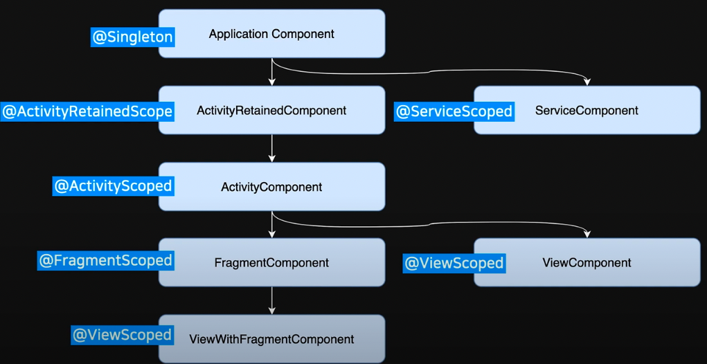

# HiltEx
-정리 중-

-`com.aos.hiltex.example1` : @Inject, @Module, @Qualifier<br>
-`com.aos.hiltex.example2` : Room + ViewModel<br>
-`com.aos.hiltex.example3` : Retrofit<br>


Dagger 2와 Hilt<br>
-Hilt는 Dagger 설정 코드를 생성하는 코드로 작동한다.<br>
-Dagger의 상용구를 제거하고 실제로 개체를 주입할 위치를 정의하는 측면만 남긴다.<br>


`@HiltAndroidApp`<br>
-Hilt를 사용하는 모든 앱에는 `@HiltAndroidApp` 어노테이션이 달린 Application 클래스가 있어야 한다.<br>
-해당 Application클래스는 앱의 생명주기와 밀접하게 연결되며, 앱의 상위 컨테이너이므로 다른 컨테이너가 이 컨테이너에서 제공하는 클래스에 엑세스할 수 있다.<br>
*컨테이너(Container):인스턴스를 저장하는 공간으로 참조가 필요한 클래스의 인스턴스들을 생성해주고 수명주기를 관리해 인스턴스를 제공하는 역할을한다.<br>
```kotlin
@HiltAndroidApp
class HiltApplication: Application()
```


`@AndroidEntryPoint`<br>
-액티비티나 프래그먼트 등에 붙여서 Hilt가 쓰인다는 것을 알려준다.<br>
-주입 가능 클래스 : `Activity`, `Fragment`, `View`, `Service`, `BroadcastReceiver`<br>


`@Inject`<br>
1. 클래스 이름 뒤에 `@Inject constructor()`를 적어준다. -> 어딘가에서 클래스가 사용<br>
```kotlin
class Store @Inject constructor() {
    fun open() = Log.i(TAG, "OPEN")
    fun close() = Log.i(TAG, "CLOSE")
}
```

2. 사용할 객체 앞에 `@Inject`를 적어준다 -> Hilt가 객체를 만들어 주입<br>
-클래스에 필드 주입(*private 에는 주입되지 않음)<br>
```kotlin
@AndroidEntryPoint
class MainActivity : AppCompatActivity() {

   @Inject lateinit var store: Store

   override fun onCreate(savedInstanceState: Bundle?) {
        super.onCreate(savedInstanceState)
        setContentView(R.layout.activity_main)

        store.opne()
   }
}
```


Hilt 모듈<br>
`@Module`<br>
-Hilt에 모듈임을 알려준다.<br>

`@InstallIn`<br>
-모듈이 어던 범위에서 쓰이는가를 나타낸다.<br>
-@Module 클래스에 @InstallIn 이 없으면 컴파일 에러가 발생한다.<br>
`SingletonComponent`, `ActivityComponent` ...<br>
```kotlin
@Module
@InstallIn(SingletonComponent::class)
object FactoryModule 
```


`@Qualifier`<br>
-특정 타입에 대해 여러 결합이 정의되어 있을 때, 인터페이스가 어떻게 구현되는지 Hilt가 구분할 수 있게 된다.<br>

`@Binds`<br>
-인터페이스에 사용할 구현을 Hilt에 알리려면 Hilt 모듈 내 함수에 `@Binds` 주석을 사용한다.<br>

`@Singleton`<br>
-애플리케이션 컨테이너에서 항상 같은 인스턴스를 제공한다.<br>
-주석을 사용하여 인스턴스의 범위를 컨테이너로 지정한다. <br>
-Hilt는 수명 주기가 다른 여러 컨테이너를 생성할 수 있으므로 이러한 컨테이너로 범위가 지정된 다양한 주석이 있다.<br>
-인스턴스 범위를 애플리케이션 컨테이너로 지정하는 주석은 `@Singleton`<br>

`@Provides`<br>
-외부 라이브러리(Retrofit, OkHttpClient, Room 등)에서 클래스가 제공되어 클래스를 소유하지 않은 경우에 사용한다.<br>
-클래스를 직접 소유하지 않은 경우, Hilt 모듈 내에 함수를 생성하고 함수에 `@Provides` 어노테이션을 지정한다.<br>
```kotlin
@Module
@InstallIn(ActivityComponent::class)
object AnalyticsModule {
    @Singleton
    @Provides
    fun provideAnalyticsService() : AnalyticsService {
        return Retrofit.Builder()
            .baseUrl("https://example.com")
            .build()
            .create(AnalyticsService::class.java)
    }
}

@Module
@InstallIn(SingletonComponent::class)
object DBModule {
    @Provides
    @Singleton
    fun provideAppDatabase(@ApplicationContext context: Context): AppDatabase = AppDatabase.getInstance(context)
}
```


`@HiltViewModel`<br>
```kotlin
@HiltViewModel
class FooViewModel @Inject constructor(
  val handle: SavedStateHandle,
  val foo: Foo
) : ViewModel
```

Hilt 범위(Scoped vs UnScoped)<br>
-UnScoped:기본적으로 Hilt의 모든 결합은 범위가 지정되지 않는다. 앱이 인스턴스를 요청할 때마다 Hilt는 필요한 유형의 새 인스턴스를 생성<br>
```kotlin
class UnscopedBinding @Inject constructor()
```
-Scoped:Hilt는 결합의 범위가 지정된 구성요소의 인스턴스마다 한 번만 범위가 지정된 결합을 생성하며, 이 결합에 관한 모든 요청은 동일한 인스턴스를 공유한다.<br>
-동기화가 필요한 결합, 만드는 데 비용이 많이 들 것으로 측정된 결합 등에서는 Hilt 범위 지정을 사용하는 것이 적절하다.<br>
`@Singleton`, `@ActivityRetainedScoped`, `@ViewModelScoped`, `@ActivityScoped`, `@ViewScoped`, `@ServiceScoped`<br>
``` kotlin
@FragmentScoped
class ScopedBinding @Inject constructor() { ... }
```





======


View
기본적으로 `SingletonComponent` 및 `ActivityComponent` 바인딩만 View에 주입할 수 있다.
View에서 Fragment 바인딩을 활성화하려면 클래스에 `@WithFragmentBindings` 어노테이션을 추가
여러 ViewModel에서 한 인스턴스를 공유해야 하는 경우 `@ActivityRetainedScoped` 또는 `@Singletone`을 사용하여 범위를 지정해야 한다.


---
Dependency injection with Hilt(프로젝트에 Hilt 추가)
https://developer.android.com/training/dependency-injection/hilt-android?hl=ko

Hilt CodeLab
https://developer.android.com/codelabs/android-hilt?hl=ko#0

힐트 Hilt 안드로이드에서 의존성 관리하기 : 외부 라이브러리 모듈로 만들기
https://software-creator.tistory.com/35

Hilt 라이브러리 이해하기
https://junyoung-developer.tistory.com/183

https://nanamare.tistory.com/m/177